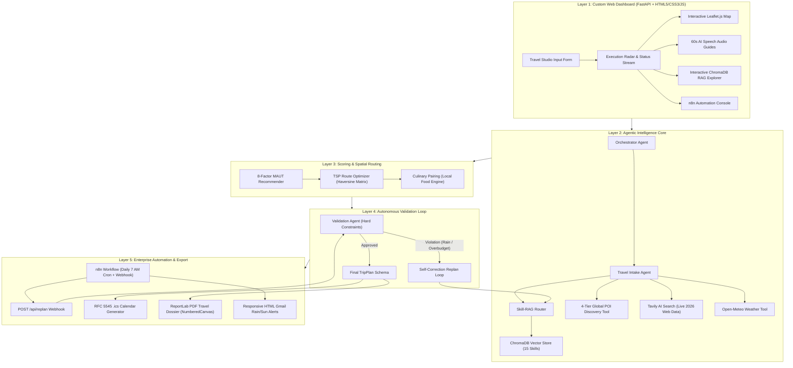
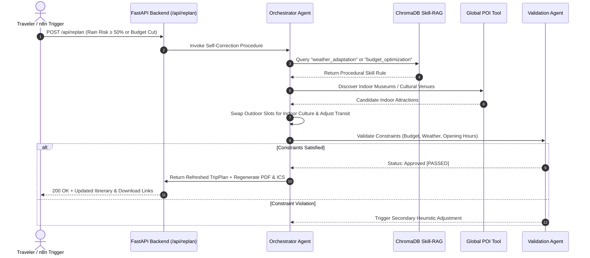
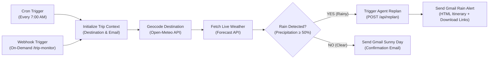
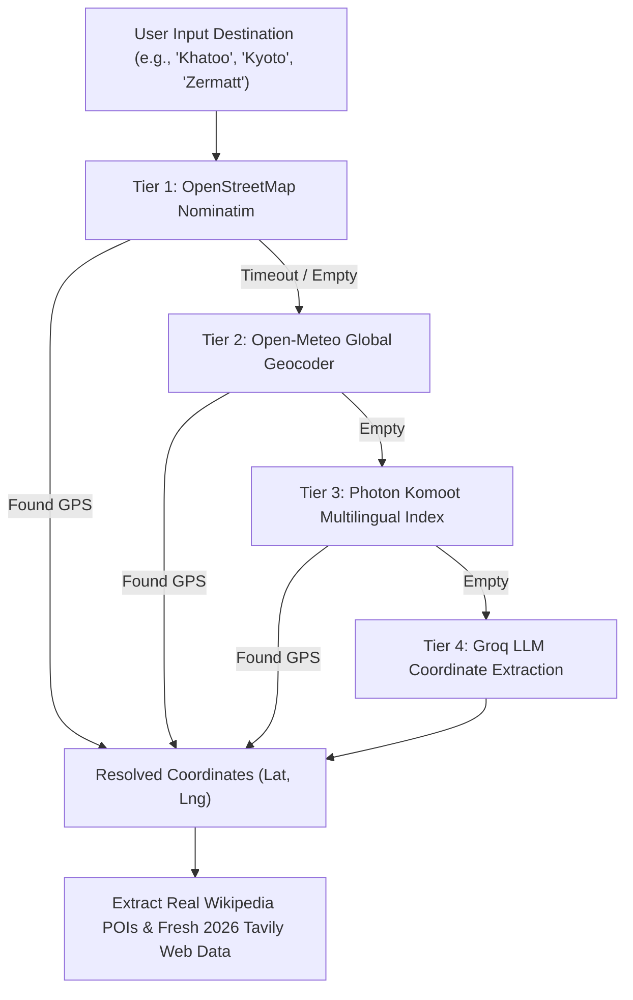

# 🌍 Smart Tourist Attraction Recommendation Agent
### Skill-Augmented Agentic AI Travel Intelligence, Global POI Discovery, ChromaDB RAG & n8n Automation

[](https://www.python.org/)
[](https://fastapi.tiangolo.com/)
[](https://www.trychroma.com/)
[](https://python.langchain.com/)
[](https://n8n.io/)
[](https://render.com/)
[](https://opensource.org/licenses/MIT)

An enterprise-grade, academic-ready **Agentic AI & Automation Travel Intelligence System** featuring a custom modern web dashboard (Zero Gradio), **Universal Global POI Discovery** for any destination worldwide, **Persistent ChromaDB Vector RAG**, **Langflow Visual Orchestration**, and **n8n Autonomous Monitoring & Gmail Alerts**.

---

## 📑 Table of Contents
- [🌟 Key Highlights](#-key-highlights)
- [🏗️ System Architecture](#️-system-architecture)
- [🔄 Autonomous Self-Correction & Replanning Flow](#-autonomous-self-correction--replanning-flow)
- [⚡ n8n Enterprise Automation Pipeline](#-n8n-enterprise-automation-pipeline)
- [🌐 4-Tier Resilient Global Geocoding Cascade](#-4-tier-resilient-global-geocoding-cascade)
- [🚀 1-Click Free Cloud Deployment](#-1-click-free-cloud-deployment)
- [⚡ Local Quickstart Guide](#-local-quickstart-guide)
- [📡 REST API Documentation](#-rest-api-documentation)
- [🧪 Automated Testing](#-automated-testing)
- [📁 Directory Structure](#-directory-structure)
- [📜 License](#-license)

---

## 🌟 Key Highlights

1. **🚫 Custom Web Application (Zero Gradio)**:
   - Built with a high-performance **FastAPI backend** and a clean, responsive **HTML5 + CSS3 + Vanilla JavaScript frontend**.
   - Features a real-time multi-agent execution radar, interactive full-width Leaflet.js maps with anti-collision pin dispersal, time-slotted timeline cards, and 60-second client-side AI audio guides.

2. **🌍 Universal Global POI Discovery (Worldwide Support)**:
   - The user can input **ANY destination in the world** (*Kyoto, Paris, Khatoo, Ujjain, Zermatt, Cusco, Cairo, Queenstown, etc.*).
   - **4-Tier Resilient Geocoding Cascade**: OpenStreetMap Nominatim $\rightarrow$ Open-Meteo Global Geocoding $\rightarrow$ Photon Komoot $\rightarrow$ Groq LLM Coordinate Resolution.
   - **Adaptive Regional Transit Modes**:
     - Automatically assigns **Auto-Rickshaw / Cab 🛺** in South Asia (`6°N–38°N, 68°E–98°E`).
     - Automatically switches to **Metro / City Tram 🚊**, **City Bus 🚌**, or **Walking 🚶** internationally.

3. **📚 Genuine Persistent ChromaDB Vector RAG**:
   - Built using **ChromaDB** (`chromadb==1.5.9`) with real vector embeddings and cosine similarity search.
   - Indexes 15 procedural planning skills (budget optimization, couple planning, crowd avoidance, weather adaptation, etc.).
   - **Interactive RAG Explorer**: In-app query console allowing users to query vector chunks and inspect similarity scores and source documents.

4. **⚡ n8n Enterprise Automation Pipeline (with Gmail Alerts)**:
   - Complete 9-node workflow in [`n8n/travel_agent_workflow.json`](n8n/travel_agent_workflow.json).
   - **Dual Triggers**: Daily 7:00 AM Cron Schedule (`0 7 * * *`) + On-Demand Webhook (`/webhook/trip-monitor`).
   - Dynamic destination geocoding via Open-Meteo API.
   - **Rain Risk Detection (≥ 50%)**: Calls the agent's `/api/replan` endpoint, moves outdoor sights indoors, and dispatches a responsive HTML **Gmail alert** with 1-click links to download refreshed calendar and PDF dossiers.
   - **Sunny Day Confirmation (< 50%)**: Dispatches a sunny morning confirmation email confirming all outdoor plans.

5. **📄 Executive PDF Travel Dossier & Calendar Sync**:
   - Generates printable ReportLab booklets with custom two-pass **`NumberedCanvas`** (running headers, footers, and `Page X of Y` stamp).
   - Auto-repeating table headers (`repeatRows=1`) across page breaks.
   - Full RFC 5545 `.ics` Calendar sync export.

6. **🔄 Autonomous Self-Correction Feedback Loop**:
   - Hard-constraint verification (Budget ≤ Cap, Opening Hours, Realistic Transit, Weather Safety).
   - If constraints fail or weather disrupts, the agent autonomously retrieves replanning skills from Skill-RAG and iterates until approved.

---

## 🏗️ System Architecture



---

## 🔄 Autonomous Self-Correction & Replanning Flow



---

## ⚡ n8n Enterprise Automation Pipeline

The 9-node visual workflow running in **[n8n](n8n/travel_agent_workflow.json)** connects scheduled background triggers with the live agent API:



---

## 🌐 4-Tier Resilient Global Geocoding Cascade

To guarantee reliable operation for **any place on Earth** without rate limits or default city hardcoding:



---

## 🚀 1-Click Free Cloud Deployment

Deploy your live travel agent with a permanent public HTTPS URL for **FREE** (no credit card required):

### Option 1: Render.com *(Recommended)*
1. Push your repository to GitHub:
   ```bash
   git remote add origin https://github.com/YOUR_USERNAME/YOUR_REPO_NAME.git
   git push -u origin main
   ```
2. Open **[https://dashboard.render.com](https://dashboard.render.com)** and sign in with GitHub.
3. Click **"New +"** $\rightarrow$ **"Web Service"** $\rightarrow$ Select your repository.
4. Render automatically reads our included [`render.yaml`](render.yaml) and [`Procfile`](Procfile):
   - **Environment**: Python
   - **Build Command**: `pip install -r requirements.txt`
   - **Start Command**: `python -m uvicorn server:app --host 0.0.0.0 --port $PORT`
   - **Plan**: Free
5. Click **"Deploy Web Service"**!
> 🔗 Your app is live at: `https://your-app-name.onrender.com`

---

### Option 2: Docker / Container Platforms (Railway, Hugging Face, Fly.io)
The repository includes a production-ready [`Dockerfile`](Dockerfile) & [`.dockerignore`](.dockerignore):
```bash
# Build Docker image
docker build -t smart-tourist-agent .

# Run Docker container
docker run -p 8000:8000 -e PORT=8000 smart-tourist-agent
```

---

## ⚡ Local Quickstart Guide

### 1. Clone the Repository
```bash
git clone https://github.com/YOUR_USERNAME/smart-tourist-agent.git
cd "Smart Tourist Attraction Recommendation Agent"
```

### 2. Set Up Virtual Environment & Dependencies
```bash
# Create virtual environment
python -m venv .venv

# Activate virtual environment
# Windows (PowerShell):
.\.venv\Scripts\Activate.ps1
# Windows (cmd):
.\.venv\Scripts\activate.bat
# Linux / macOS:
source .venv/bin/activate

# Install dependencies
pip install -r requirements.txt
```

### 3. Configure Environment Variables (Optional)
Copy `.env.example` to `.env`:
```bash
cp .env.example .env
```
Add your free API keys if available:
- `GROQ_API_KEY`: Free key from [console.groq.com](https://console.groq.com/)
- `GEMINI_API_KEY`: Free key from [Google AI Studio](https://aistudio.google.com/)
- `TAVILY_API_KEY`: Free key from [tavily.com](https://tavily.com/)
- `N8N_TUNNEL_URL`: Public ngrok URL if connecting n8n Cloud (`https://your-tunnel.ngrok-free.dev`)

*(Note: If no API keys are provided, the system seamlessly uses OpenStreetMap + Open-Meteo + Wikipedia + ChromaDB for 100% free offline operation!)*

### 4. Launch the FastAPI Application
```bash
python server.py
```
Open your browser at:
👉 **`http://127.0.0.1:8000`**

---

## 📡 REST API Documentation

| Method | Endpoint | Description |
| :--- | :--- | :--- |
| `GET` | `/` | Serves the main single-page web dashboard |
| `POST` | `/api/plan` | Primary multi-agent trip planner (Global POIs, MAUT scoring, TSP routing) |
| `POST` | `/api/replan` | Autonomous self-correction replanning (weather disruption / budget cuts) |
| `POST` | `/api/rag/query` | Semantic vector search across ChromaDB procedural skills |
| `GET` | `/api/langflow/status` | Real-time status of Langflow visual orchestrator bridge |
| `POST` | `/api/langflow/execute` | Executes flow via visual Langflow engine |
| `GET` | `/api/n8n/config` | Exposes active public webhook and tunnel configuration |
| `POST` | `/api/n8n/webhook/weather-check` | n8n daily morning check webhook trigger |
| `POST` | `/api/n8n/webhook/trip-created` | Registers new trip for n8n automated monitoring |
| `POST` | `/api/n8n/simulate` | Simulates incoming n8n morning cron trigger |
| `GET` | `/api/download/ics/{trip_id}` | Serves RFC 5545 `.ics` Calendar sync file |
| `GET` | `/api/download/pdf/{trip_id}` | Serves ReportLab printable PDF Travel Dossier |

---

## 🧪 Automated Testing

Run the automated test suite with pytest:
```bash
python -m pytest -v tests/test_agents.py
```

---

## 📁 Directory Structure

```text
Smart Tourist Attraction Recommendation Agent/
├── server.py                       # FastAPI application backend entrypoint
├── config.py                       # Application configuration & environment settings
├── requirements.txt                # Production dependencies
├── render.yaml                     # 1-Click Render Cloud deployment blueprint
├── Procfile                        # WSGI/ASGI cloud process definition
├── Dockerfile                      # Production container image
├── .dockerignore                   # Docker build exclusions
├── .env.example                    # Template environment variables
├── .gitignore                      # Git exclusion rules (secrets, venvs, cache)
├── LICENSE                         # MIT License
├── static/
│   ├── css/
│   │   └── styles.css              # Custom styling
│   └── js/
│       └── app.js                  # Frontend logic: Leaflet map, audio guides, API calls
├── templates/
│   └── index.html                  # Responsive single-page web dashboard
├── data/
│   ├── chroma_db/                  # Persistent ChromaDB vector database
│   ├── skills_data.py              # Registry of 15 actionable planning skills
│   ├── curated_attractions.json    # Curated destination benchmark dataset
│   ├── places_cache.json           # Real-time POI cache
│   └── skills_library/             # Individual JSON skill files (Skill-RAG)
├── models/
│   └── schemas.py                  # Pydantic data schemas
├── tools/
│   ├── chroma_rag.py               # ChromaDB Vector Store & Dynamic Ingestion Engine
│   ├── global_poi_tool.py          # 4-tier global geocoding & POI discovery
│   ├── tavily_tool.py              # Tavily AI Search Tool
│   ├── weather_tool.py             # Open-Meteo Weather Tool
│   ├── route_tool.py               # Haversine Distance Matrix & TSP Solver
│   ├── budget_tool.py              # Budget Itemizer & Variance Calculator
│   ├── langflow_bridge.py          # Langflow API Bridge & Runner
│   ├── ics_tool.py                 # RFC 5545 iCalendar Exporter
│   └── pdf_tool.py                 # ReportLab PDF Dossier Exporter (NumberedCanvas)
├── agents/
│   ├── orchestrator.py             # Multi-Agent State Machine & Execution Engine
│   ├── recommender.py              # 8-Factor MAUT Scoring & Explainability
│   ├── itinerary_builder.py        # Daily Timetable Scheduling & Food Pairing
│   └── validator.py                # Self-Correction Replan Engine
├── langflow/
│   ├── smart_tourist_flow.json     # Visual Langflow Flow definition
│   └── README.md                   # Langflow setup guide
├── n8n/
│   ├── travel_agent_workflow.json  # Complete 9-node n8n automation workflow
│   └── README.md                   # n8n setup guide
├── tests/
│   └── test_agents.py              # Pytest automated test suite
├── PROJECT_REPORT.md               # Comprehensive College Project Report
└── README.md                       # Documentation and quickstart guide
```

---

## 📜 License

This project is licensed under the MIT License - see the [LICENSE](LICENSE) file for details.
